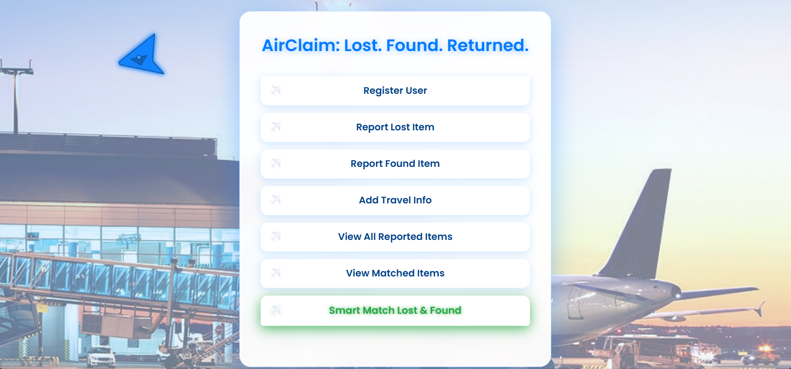
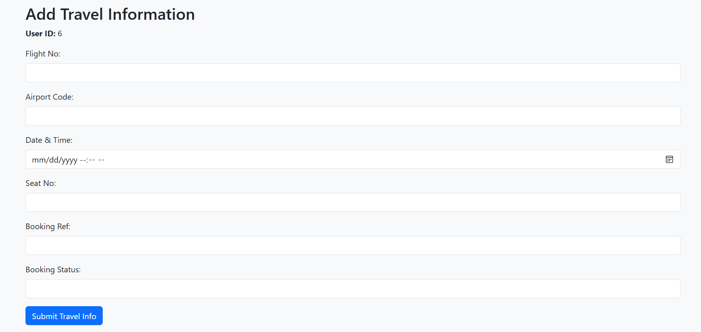
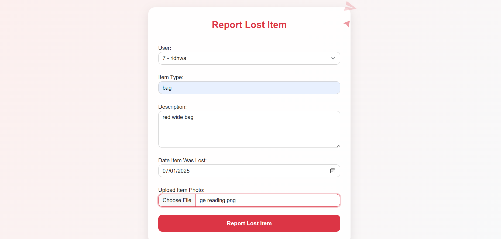
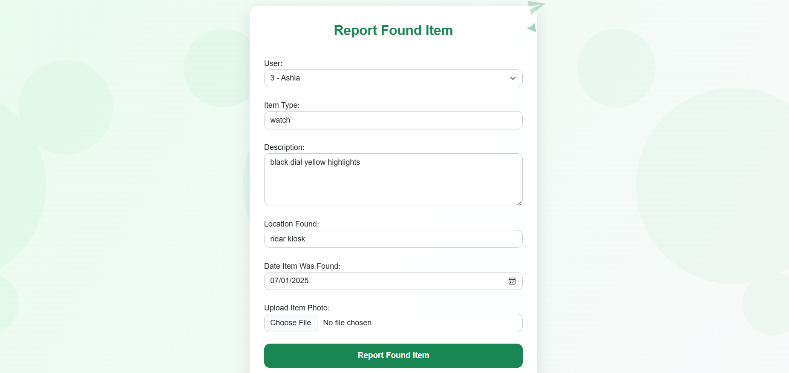
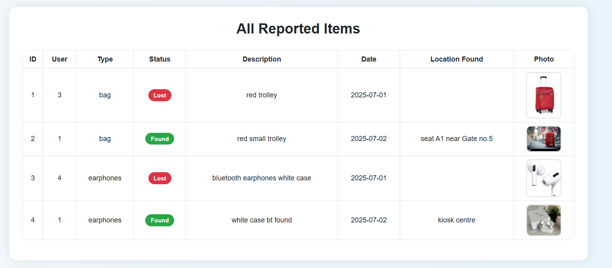
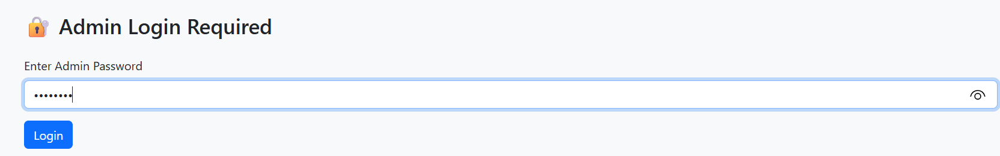
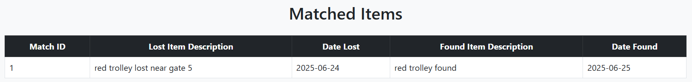

# ✈️ Lost & Found Management System for Airports

A secure and smart full-stack **Lost & Found web application** built using **PHP**, **MySQL**, and **Bootstrap**, tailored for airport environments. This system streamlines the process of reporting, tracking, and matching lost and found items for both **passengers** and **staff**, with strict **admin-controlled verification**.

---

## 🔑 Key Features

- 👤 **Role-Based Registration**
  - Staff members must provide a valid **Staff ID** for authentication.
  - Passengers are redirected to submit **travel details** as part of registration.

- 🧾 **Item Reporting**
  - Users can report **Lost** or **Found** items with detailed descriptions and optional image upload.
  - Report dates are validated — no future or too-old entries allowed.

- 🛡️ **Admin Authentication**
  - Smart matching of lost and found items is secured via **admin password log in**.
  - Only authenticated admins can match and confirm items.

- 🤝 **Smart Matching System**
  - Admin can view and select potential matches between lost and found items.
  - Status can be set to **Pending**, **Confirmed**, or **Rejected**.

- 📸 **Image Upload**
  - Users can upload photos of items during reporting for better identification.
  - Stored in a secure `/uploads` directory.

---

## 🖼️ Sample Output Screens

> 💡 Below are the screenshots demonstrating key flows of the application:

1. **Clean UI for best experience**
   

2. **Passenger Registration Form with Travel Info**
   

3. **Staff Registration with Staff ID Authentication**
   

4. **Reporting Lost Items Interface**
   

5. **Reporting Found Items Interface**
   

6. **View All Reported Items**
   

7. **Admin Log In Verification (Smart Match Access)**
   

8. **Smart Match Interface (Admin-Only)**
   

9. **Matched Items Display**
   

---

## 🏗️ Tech Stack

- **Frontend**: HTML, CSS, Bootstrap 5
- **Backend**: PHP (MySQLi)
- **Database**: MySQL (XAMPP)
- **Tools**: phpMyAdmin, Git

---

## 🔐 Authentication Flow

- 👨‍✈️ **Admin Password** is required to access the matching interface.
- 👨‍🔧 **Staff Users** must enter a valid **Employee ID**.
- 🧳 **Passengers** are redirected to enter **Travel Info** (Flight No, Airport Code, Seat No, etc).

---

## 📂 Project Structure

lost_found_2.O/

├── items/ # Lost/Found item reporting

├── matches/ # Matching logic (admin-only)

├── travel/ # Travel info form (for passengers)

├── user/ # Registration logic

├── uploads/ # Uploaded item images

├── db.php # DB connection

├── index.html # Home UI

├── view_items.php # View all items

├── .gitignore # Keeps uploads clean

